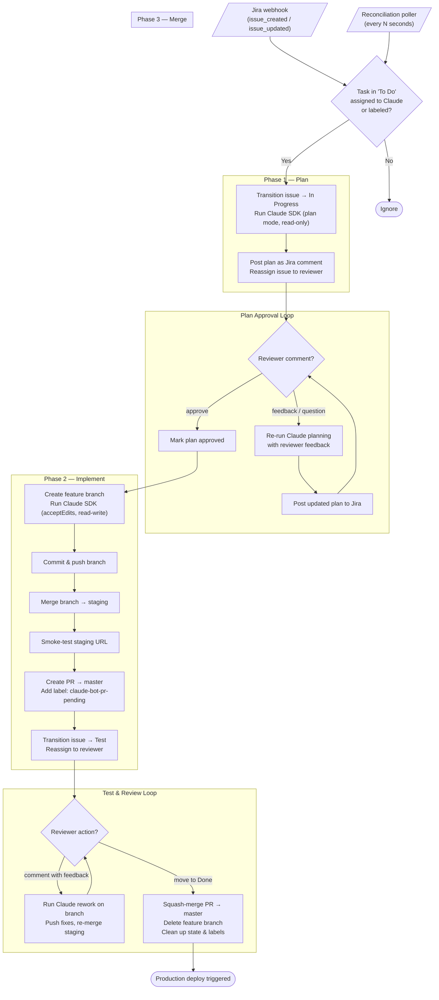
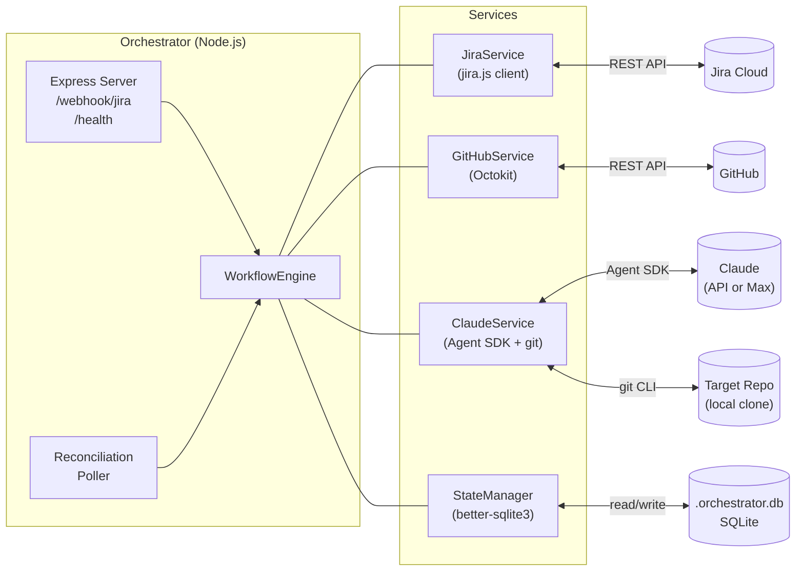
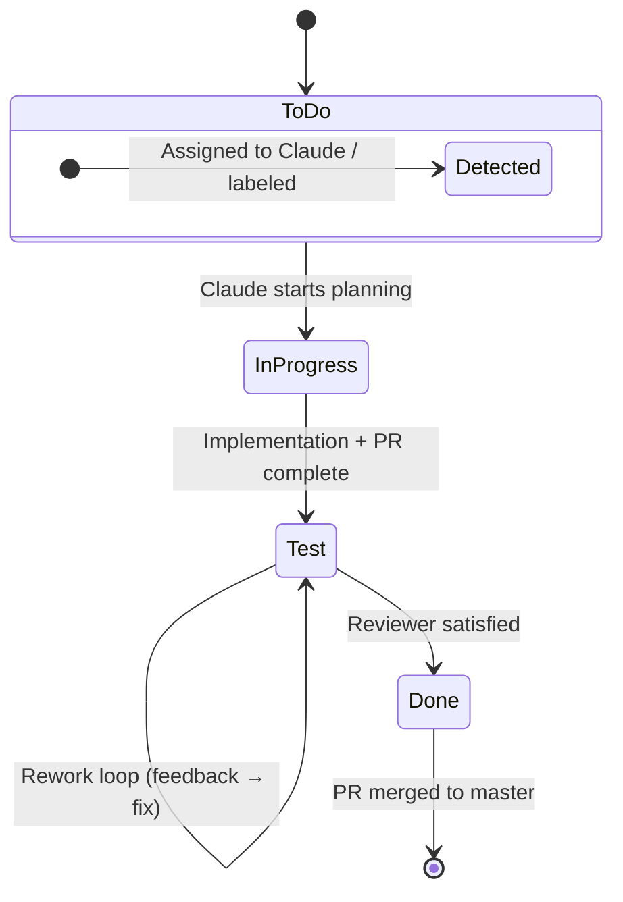

# Architecture

Automated pipeline that watches a Jira project for tasks assigned to Claude, generates implementation plans for human approval, codes the approved plan via the Claude Agent SDK, deploys to a staging branch for review, and merges to master when the task is moved to "Done" — all driven by webhooks with a reconciliation poller as fallback.

## Main Workflow

## Component Diagram

## Jira Status Transitions

## Key Labels & Statuses

| Concept | Value | Purpose |
|---|---|---|
| **Claude label** | `claude-bot` (configurable) | Marks a task for Claude to pick up |
| **PR-pending label** | `claude-bot-pr-pending` | Tracks issues with an open PR awaiting review |
| **Jira statuses** | To Do → In Progress → Test → Done | Board columns the orchestrator transitions through |
| **Internal phases** | `planning` · `plan-posted` · `approved` · `implementing` · `test` · `merging` · `failed` | Tracked in SQLite to survive restarts |
| **Claude plan mode** | `plan` (read-only tools) | Used during planning — no file edits |
| **Claude implement mode** | `acceptEdits` (read-write) | Used during implementation and rework |
| **Merge strategy** | Squash merge | Feature branch → master via GitHub API |
| **Staging branch** | `staging` | Feature branch merged here for pre-production testing |
